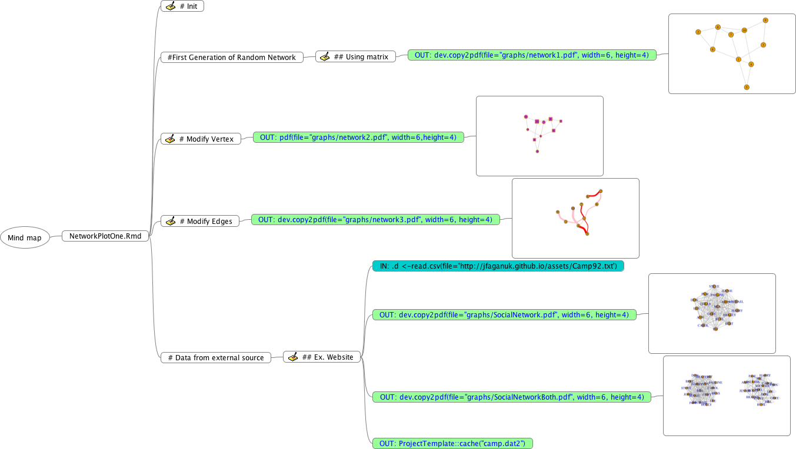

## Quick guide to the usage of MarTMi

Make sure that you have the proper path to the Markdown file that you wish to convert and that you have changed the options in configure.yml to match what you need.

## Converting Markdown file(s) to a Mindmap file
Run:

```{r}
library(MarTMi)
example("Print_MM_Map")
```

You will get a Mindmap file named 'Mindmap.mm' placed in your current working directory. You can open it using FreeMind or any other Mindmap program out there that can read '.mm' files.

The program determines the location for each node by looking for the headers before each codeblock and uses the number of pound sign(s) in each header to determine the location of the node. The more pound signs, the farther the node is from the title of the mindmap. The code that is associated with that header is then displayed as a note in the node. 

The program also checks to see whether there are any subheaders (headers with more than one pound sign that lie after a header with a single pound sign), and creates subnodes with the respective codeblocks as notes.

The program will not work as well if there are no subtitles before the codeblocks. 

## Converting Mindmap file to Markdown file
Run:

```{r}
library(MarTMi)
example("PrintRMDFile")
```
You will get a Markdown file with the name 'mm_output.Rmd' placed in your current working directory.

It is highly recommended that the working directory is similar to the template generated by the package ProjectTemplate. You can find out more about ProjectTemplate at [this link](https://cran.r-project.org/web/packages/ProjectTemplate/ProjectTemplate.pdf).

The headers for the Markdown file are determined by the node location. The farther the nodes are from the title, the more pound signs are included in front of the header. This reverses what 'Print_MM_Map' does.
Keep in mind that the Mindmap file should follow a similar format to the output of 'Print_MM_Map' or else 'PrintRMDFile' will not work.

Example: (This is the result of example(Print_MM_Map))


 

